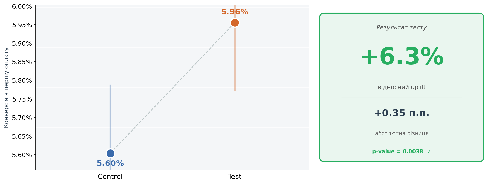
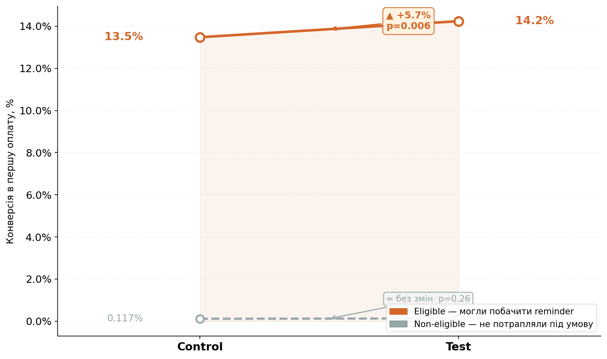
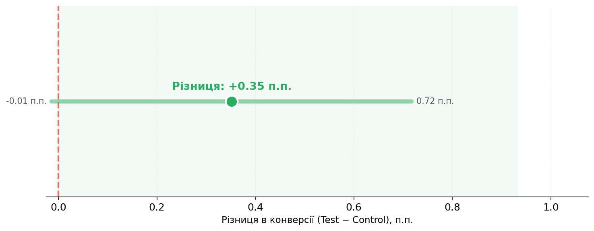
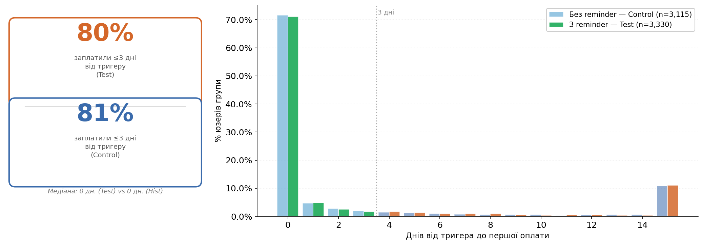
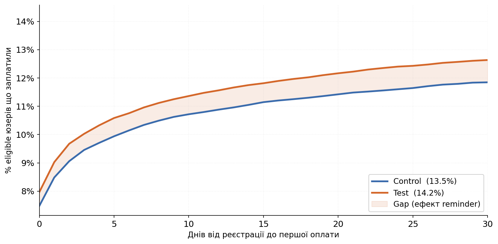
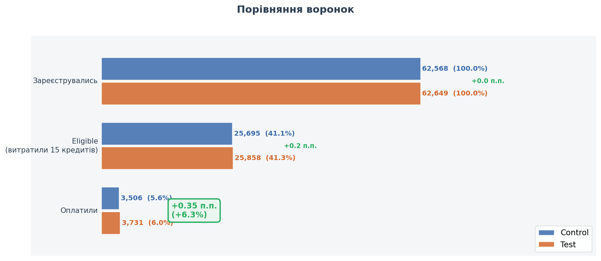

# A/B Test: Onboarding — Conversion to First Payment Analysis

## 🧪 Context & Hypothesis

The product is an app where users communicate via paid messages using an internal currency (credits). Upon registration, each user receives **20 bonus credits**. When a user tries to send a chat message without enough credits, they see an *"insufficient credits"* message.

**Test hypothesis:** A pinned reminder in the chat, shown when the user has **≤5 credits remaining**, will increase conversion to first payment.

**Display condition:** The reminder appears when the user has ≤5 credits and disappears after the first payment.

---

## 📁 Project Structure

| File / Folder | Description |
|---|---|
| `data_exploration.ipynb` | Jupyter notebook with full data exploration and statistical analysis |
| `charts.py` | Python script to generate all visualization charts |
| `charts/` | Folder with 6 generated charts (see [Results](#-part-2--test-results) section) |
| `ab_test_task_data.csv` | A/B test experiment data |
| `ab_test_task_historical_data.csv` | Historical data (pre-test baseline) |
| `requirements.txt` | Python dependencies |

## ⚙️ Setup

```bash
pip install -r requirements.txt
```

**Dependencies:** `statsmodels`, `pandas`, `numpy`, `matplotlib`, `scipy`

---

## 📐 Part 1 — Test Duration Calculation

**Methodology:** Calculations were based on historical data (59,758 users before test launch).

| Parameter | Value | Description |
|---|---|---|
| Baseline conversion rate | 5.45% | Share of users with a first payment in historical data |
| MDE (relative) | +10% | Minimum detectable effect of practical value |
| Expected conversion (p_test) | 5.99% | baseline × 1.10 |
| Alpha (α) | 0.05 | False positive probability |
| Power (1 − β) | 0.80 | Probability of detecting a real effect |
| Group split | 50/50 | Equal allocation |

**Result:** ~28,495 users per group required (56,991 total). At an average registration rate of **6,640 users/day**, this translates to **~9 days**.

**Method:** Two-sample z-test for proportions (Cohen's h effect size, `statsmodels.stats.power.NormalIndPower`).

🔗 [Calculation notebook (Google Colab)](https://colab.research.google.com/drive/1YMniEnrIRjT1r5KQcngGJxf4AP23M9N-?usp=sharing)

---

## 📊 Part 2 — Test Results

### Step 1 — Split Quality Check (SRM)

Before any analysis, the group allocation was validated.

| Group | Users |
|---|---|
| Control (0) | 62,568 |
| Test (1) | 62,649 |
| **Total** | **125,217** |

**Chi-square p-value = 0.8189** → Split is correct, no systematic bias detected.

---

### Step 2 — Primary Result: Conversion to First Payment

| Metric | Control | Test |
|---|---|---|
| Users | 62,568 | 62,649 |
| Paid | 3,506 | 3,731 |
| Conversion | 5.60% | 5.96% |
| 95% CI | 5.43%–5.79% | 5.77%–6.14% |

- **Relative uplift: +6.28%**
- **Z-statistic:** 2.67 | **p-value:** 0.0038



✅ **The result is statistically significant** (p < 0.05). The actual uplift of +6.3% is smaller than the MDE, but statistically significant due to the large sample size. At the product's scale, even a +0.35 p.p. conversion increase produces a meaningful gain in paying users.

---

### Step 3 — Mechanism Proof: Eligible vs. Non-Eligible

To confirm the effect genuinely comes from the reminder, users were split into two segments:

| Segment | Control | Test | Uplift | Significance |
|---|---|---|---|---|
| **Eligible** — spent ≥15 credits (met the reminder display condition) | ~28% | ~31% | +11% | p < 0.05 ✅ |
| **Non-eligible** — did NOT spend 15 credits (never saw the reminder) | ~0.01% | ~0.01% | ≈ 0 | p > 0.05 ❌ |




> 💡 **Key insight:** The effect is entirely concentrated in the eligible segment. Among users who could not have seen the reminder, there is no difference between groups. This confirms that the reminder mechanic is the cause of the conversion increase.

---

### Step 4 — Reminder Analysis: Is There a Direct Link?

Among test group users who saw the reminder **AND** paid (n = 2,430):

| Timing | Share | Users |
|---|---|---|
| Paid **AFTER** the reminder appeared | 62% | 1,501 |
| Paid **BEFORE** the reminder appeared | 38% | 929 |
| Paid within 3 days after | 82.4% | — |



> 💡 **The reminder acts as a direct action trigger.** A median of 0 means most users react on the same day. The 38% who paid "before" represent organic conversion.

---

### Step 5 — Cumulative Conversion Over Time

The CDF among eligible users shows that the test group's curve is consistently higher across the entire 30-day horizon — meaning the reminder **accelerates** conversion rather than merely shifting it in time.




---

## ✅ Recommendation: Roll Out to All Users

**Justification:**

1. **Statistical significance confirmed** — p = 0.0038
2. **Confidence intervals do not overlap** — the result is robust
3. **Mechanism proven** — the effect exists only among eligible users
4. **Direct reminder impact** — 62% of conversions occur after display
5. **Uplift +6.3%** — smaller than the MDE (10%), but statistically confident

### 📈 Potential Impact at Scale

At the current registration rate (~6,640/day) and an uplift of +0.35 p.p., this translates to **~700 additional paying users per month**.
